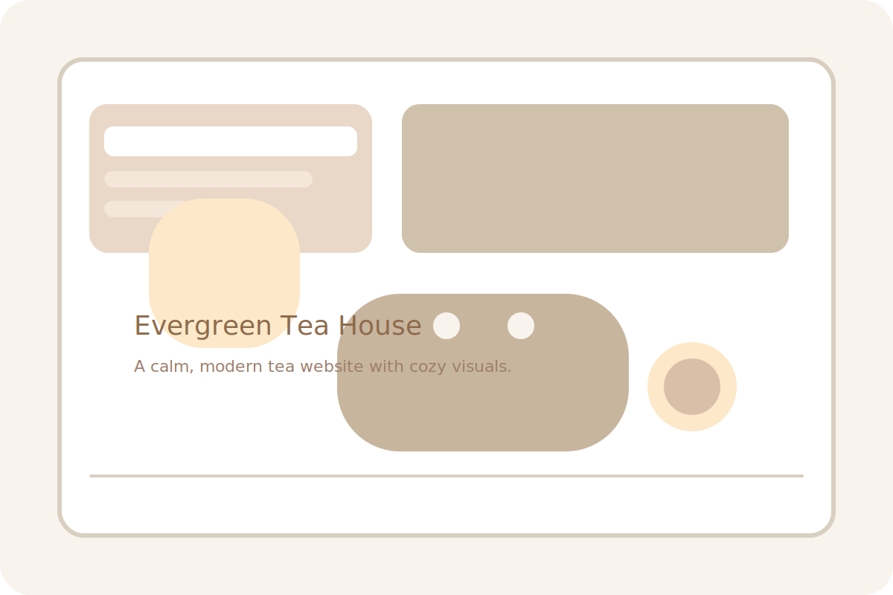

# Evergreen Tea House



A modern, multi-page website for a cozy tea house featuring artisan teas, calming flavors, and warm moments. This project includes 5 beautifully designed pages with smooth animations and interactive elements.

## 🌿 Features

- **5 Complete Pages** – Home, Menu, About, Contact, and Gallery
- **Responsive Design** – Beautiful UI that works across devices
- **Interactive Effects** – Smooth scrolling, hover states, and animations
- **Modern Styling** – Gradients, glassmorphism, and subtle shadows
- **Easy Navigation** – Clean menu and mobile-friendly layout

## 🛠️ Tech Stack

- **HTML5** – Semantic markup for accessibility and structure
- **CSS3** – Responsive styling, transitions, and animations
- **JavaScript** – Page interactions and UI enhancements

## 📁 Project Structure

```
unstop/
├── index.html      # Home page with hero section and intro
├── menu.html       # Tea menu with attractive cards
├── about.html      # About page with story and team
├── contact.html    # Contact page with form and details
├── gallery.html    # Gallery with images and events
├── styles.css      # Global styling and animations
├── script.js       # JavaScript interactions
├── assets/preview.svg # Project preview image
└── README.md       # Project documentation
```

## 🚀 Run Locally

# Recommended
```bash
cd /home/kalaiyarasan/Projects/unstop
python3 -m http.server 8000
```
Open `http://localhost:8000` in your browser.

# Direct Open
- Open `index.html` in your browser directly.

### VS Code Live Server
- Install Live Server
- Open `index.html` with Live Server

## ✨ What’s Included

- Clean, modern UI with a cozy tea house theme
- Responsive layout for desktop and mobile
- Smooth scroll and hover animations
- Multi-page navigation for a complete website experience
- A gallery page to showcase images and events

## 📝 Files

- `index.html` – Main landing page
- `menu.html` – Tea menu and featured items
- `about.html` – Story, values, and team section
- `contact.html` – Contact details and form layout
- `gallery.html` – Visual gallery and event showcase
- `styles.css` – Site styling and responsive rules
- `script.js` – Interactive behavior and scroll effects
- `assets/preview.svg` – Project preview image

## 💡 Future Improvements

- Add form submission handling
- Add customer testimonials
- Add real tea images and product details
- Add an ordering or booking system

## 📄 License

Open source project

---

**Enjoy exploring Evergreen Tea House!** ☕
